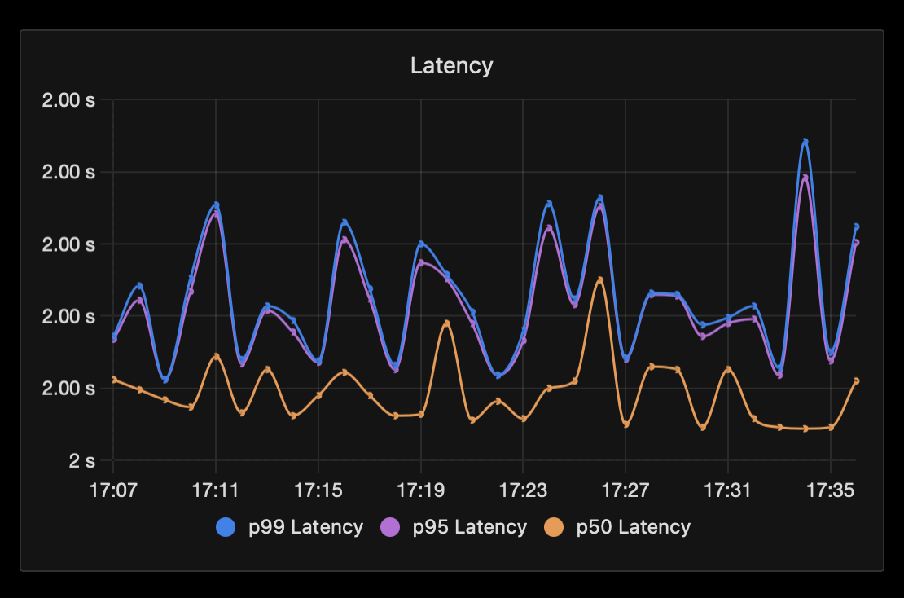
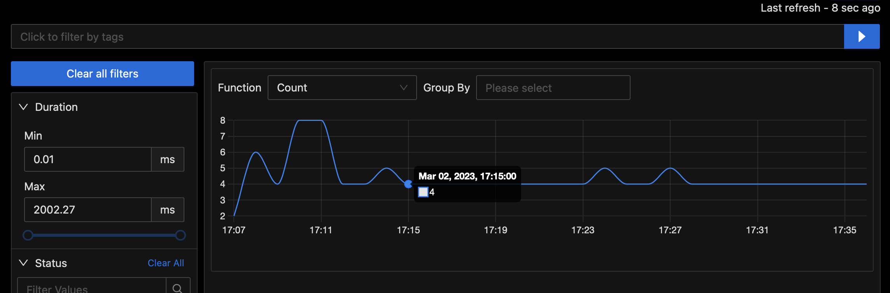
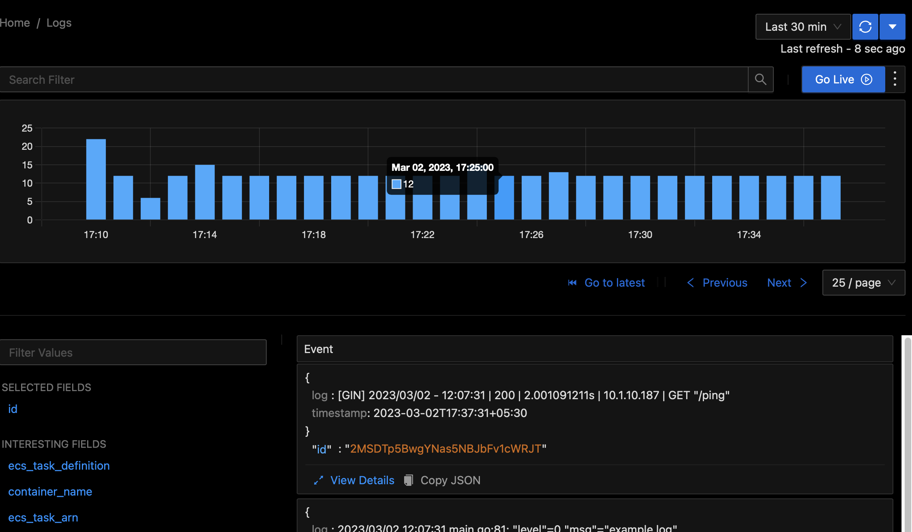
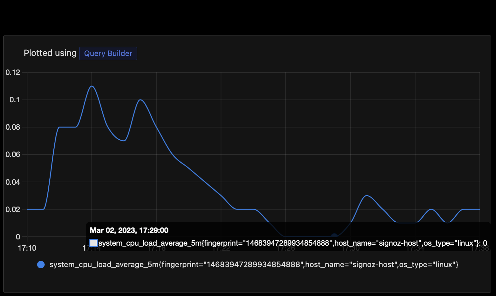
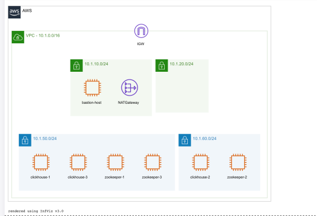
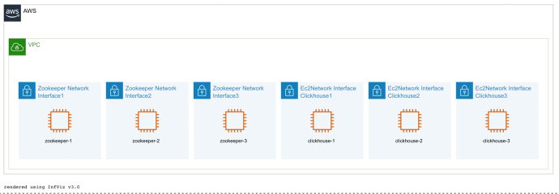
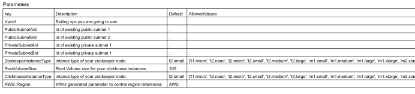

This template allows you to deploy signoz on aws ecs fargate. [(what is signoz?)](https://signoz.io/)

Signoz provides comprehensive monitoring for your application. It tracks and monitors all the important metrics and logs related to your application, infrastructure, and network, and provides real-time alerts for any issues.

You can get traces,metrics and logs of your application.



Latency of api calls to a sample application in signoz.


Traces of our sample application in signoz.


Logs of our sample application in signoz


CPU metrics of our sample application in signoz
---
Self hosting signoz on aws ecs fargate is also significantly cheaper than using aws native services like xray and cloudwatch to collect metrics,traces and logs.Signoz consists of a clikhouse cluster and multiple services which, hosting them is tedious and inconvenient but this template allows you to do so using a single command.
---
### Pre-Requisites:

1. please have bash utility [jq](https://stedolan.github.io/jq/download/) installed to process json.
2. please have bash utility [yq](https://github.com/mikefarah/yq) installed to process yml. 
3. please install the [aws-cli](https://docs.aws.amazon.com/cli/latest/userguide/getting-started-install.html) and [docker](https://docs.docker.com/engine/install/). 
4. Please have aws cli [To configured](https://docs.aws.amazon.com/cli/latest/userguide/cli-configure-quickstart.html) with access key,secret and region. 
5. please have aws copilot version of the current develop branch on github. [To install - use make to install a standalone binary](https://github.com/aws/copilot-cli/blob/eda606604b61a4b00cdf0de4847784eb7a633b7d/CONTRIBUTING.md#environment)
6. please configure signoz-ecs-config.yml file with appropriate values.


### Config File:

The signoz-ecs-config.yml files containes all our configuration :

```yaml
                    signoz-app:
                        existing-vpc: "false" # toggle this option true if you want to use your own existing vpc to deploy clickhouse and fargate services
                        otel-service-name: "otel" # name of the otel collector service usied _Signoz_
                        query-servcice-name: "query" # name of the query service usied _Signoz_
                        alert-service-name: "alert" # name of the alert service usied _Signoz_
                        frontend-service-name: "frontend" # name of the frontend service usied _Signoz_
                        clickhouse-host-name: "" # value of the clickhouse host if you are using your own deployment, will be overwritten by our scripts during deployment
                        environment-name: "dev" # environment name to be used by the copilot cli
                        application-name: "signoz-a" # appliation name to be used by copilot cli
                        clickhouse-stack-name: "clickhouse1" # name of the cloudformation stack to deploy clickhouse
                        zookeeper-disk-size: 30 # the disk size of your zookeeper instances
                        clickhouse-disk-size: 30 # the disk size of your clickhouse instances
                        zookeeper-instance-type: "t2.small" # ec2 instance type - for experimenting please use t2.small, otherwise recommended type is m5.large, it is alsoo depended on the expected load
                        clickhouse-instance-type: "t2.small" # ec2 instance type - for experimenting please use t2.small, otherwise recommended type is m5. xlarge, it is alsoo depended on the expected load
                        fluentbit-repo-name: "fluentbit-repository" # name of ecr repository where we will upload a custom docker image , which is used by aws firelens to forward our logs
                        fluentbit-local-image-name: "custom-fluent" # name of the image locally which we will upload to ecr
                        fluentbit-image-url: "" # ecr image url of the custom fluentbit image we have uploaded
                        public-subnet-a-id: "" # please add subnet id if using custom vpc and subnets, will be overwritten by our scripts
                        public-subnet-b-id: "" # please add subnet id if using custom vpc and subnets, will be overwritten by our scripts
                        private-subnet-a-id: "" # please add subnet id if using custom vpc and subnets, will be overwritten by our scripts
                        private-subnet-b-id: "" # please add subnet id if using custom vpc and subnets, will be overwritten by our scripts
                        vpc-id: "" # please add vpc id if using custom vpc and subnets, will be overwritten by our scripts
                        otel-service-endpoint: "" # written by our script..will be the endpoint of the otel collector used by the otel sdk

```
---
To instrument your applications and send data to SigNoz please refer- https://signoz.io/docs/instrumentation/
---

How to send logs of your ecs fargate service to signoz?

To send logs of your application to signoz we are going to use [aws firelens](https://aws.amazon.com/about-aws/whats-new/2019/11/aws-launches-firelens-log-router-for-amazon-ecs-and-aws-fargate/).FireLens works with Fluentd and Fluent Bit. We provide the AWS for Fluent Bit image or you can use your own Fluentd or Fluent Bit image. We will create our own custom image where will configure rules which will forward logs from our application to the signoz collector using the fluentforward protocol.
When you deploy the template it will automatically deploy our custom fluentbit image to aws ecr and we have configured our signoz otel collector to accept logs via firelens.Using the command _make scaffold svcName_ we can create a sample manifest file for you with firelens preconfigured. Configuring firelens using aws copilot is extremely easy, just add follwing to the mainfest file
```yaml
                                                            logging:
                                                                image: public.ecr.aws/k8o0c2l3/fbit:latest
                                                                configFilePath: /logDestinations.conf
```
To manuall upload the fluenbit image use command:
```
    make fluentbit-upload
```

---
In this template we are using cloudformation to host our clickhouse cluster and aws copilot to host our services on ecs fargate.
---
### Hosting a clickhouse cluster using aws cloudformation:

The template can be configured if you want to create a new vpc for our clickhouse-cluster or create the cluster in an existing vpc.
To create the cluster in an existing vpc just toggle the value of existing vpc to true.
                                        signoz-app:
                                            existing-vpc: "true"

When existing-vpc option is toggled false it will create the following resources:



This will create a new vpc with two private subnets and two public subnets. We will host 3 zookeeper instances and 3 shards of clickhouse instacnce in our private subnets. This will also host a bastion instance in our public instance if we ever want to ssh into our instaces to debug some issues.


When existing-vpc option is toggled true:

You will also have to configure vpc id,public and private subnets option in signoz-ecs-config.yml file

                                        signoz-app:
                                            public-subnet-a-id: ""
                                            public-subnet-b-id: ""
                                            private-subnet-a-id: ""
                                            private-subnet-b-id: ""
                                            vpc-id: ""





This creates three zookeeper instances and three clickhouse shards in private subnets of your vpc.

If you are using a managed clickhouse-service, you can mention the host of one of the shards, then will not create it's own clickhouse cluster(on port 9000):
                                        signoz-app:
                                            clickhouse-host-name: ""
                                            

You can use custom ami's for zookeeper or clickhouse instances if your organization has special security needs or want to add more functionality (we have made our own [user-data](https://docs.aws.amazon.com/AWSEC2/latest/UserGuide/user-data.html) scripts, so each clichouse shard and zookeeper can know about each other at start time). If you do not want to copy your ami's outside of a single region just replace the _ImageId_ field. If you want to copy ami's to all region then use ./scripts/copy-ami.sh script and ./scripts/amimap.sh to generate the mappings,then replace the existing mappings with the output.

---

Why are we using aws copilot?

AWS Copilot CLI simplifies the deployment of your applications to AWS. It automates the process of creating AWS resources, configuring them, and deploying your application. This can save you time and effort compared to manual deployment.It simplifies the deployment of your applications to AWS. It automates the process of creating AWS resources, configuring them, and deploying your application. This can save you time and effort compared to manual deployment.
Aws copilot will allow us to deploy all our signoz services with minimum configuration

You are free to use your own custon vpc and subnets, though they should be the same as your clickhouse cluster(if hosting in a private subnet).
You will also have to configure vpc id,public and private subnets option in signoz-ecs-config.yml file

                                        signoz-app:
                                            public-subnet-a-id: ""
                                            public-subnet-b-id: ""
                                            private-subnet-a-id: ""
                                            private-subnet-b-id: ""
                                            vpc-id: ""


#### Configuring values in signoz-ecs-config.yml

1. If your want to use an existing vpc keep the value of existing-vpc other than true.
2. You can change the name of any of the services if you want to.
3. You can change the name of cloudformation stack of your clickhouse cluster
4. can change the instance type of your clikhouse or zookeeper hosts
5. can change the environment name and application name for the copilot cli.

### To deploy aws on ecs sigoz:

(Please keep the value of clickhouse host blank if you want to deploy a new cluster in your vpc)


#### If you want to deploy from scratch - to deploy your own vpc,clickhouse cluster and fargate cluster

first configure signoz-ecs-config.yml with appropriate values(do not change the value of existing-vpc=no)

Then execute the script with 
```
make deploy
```

#### If you want to deploy clickhouse cluster and services in your own vpc:

configure vpc id and subnet id in signoz-ecs-config.yml
make the value of variable existing-vpc to true
add the vpc id and all the subnets id

```
make deploy
```
#### If you have already deployed clickhouse cluster and want to deploy all services in a new vpc and fargate cluster:

configure the clickhouse host in signoz-ecs-config.yml

```
make deploy
```

#### If you have already deployed clickhouse cluster and want to deploy all services in an existing vpc:

configure the clichouse host in signoz-ecs-config.yml
configure vpc id and subnet id in signoz-ecs-config.yml

```
make deploy
```

#### If you have already configured copilot with an app name and environment(the subnets should be the same as the one where clickhouse cluster is present):

configure the clickhouse host in signoz-ecs-config.yml
configure vpc id and subnet id in signoz-ecs-config.yml

```
make deploy-existing-copilot-app
```


To scaffold a service with a sample file use command:

```
make scaffold $service-name
```

To use your own custom ami's for clickhouse and zookeeper  :
 
    you can copy the ami's in all region using the script :
```
./scripts/copy-ami.sh
```

    then you can use the script to get a mapping of all ami's using:
```
./scripts/amimap.sh
```
    Then replace the mappings in the clickhouse.yml cloudformation template
    

