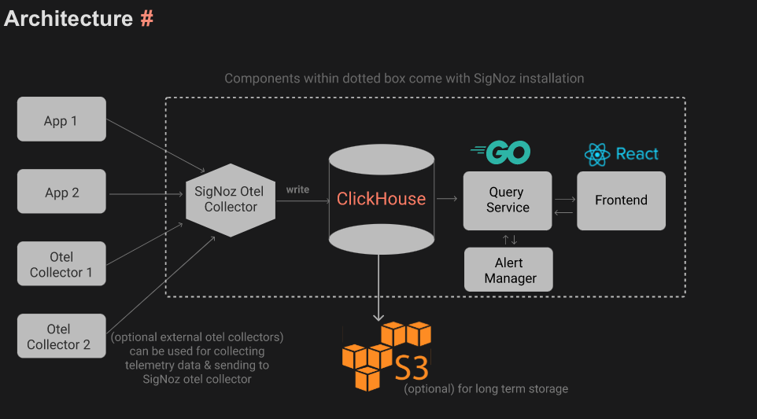

### This template allows you to deploy signoz on aws ecs fargate. [(what is signoz?)](https://signoz.io/)

## Table of contents
* [About Signoz](#about-signoz)
* [Pre-requisites](#pre-requisites)
* [Config-File](#config-file)
* [Hosting clickhouse using cloudformation](#hosting-a-clickhouse-cluster-using-aws-cloudformation)
* [Using AWS Copilot](#why-are-we-using-aws-copilot)
* [Instrumenting our application](#how-to-send-logs-of-your-ecs-fargate-service-to-signoz)
* [Sending logs](#how-to-send-logs-of-your-ecs-fargate-service-to-signoz)
* [Deploying signoz on aws ecs](#to-deploy-signoz-on-aws-ecs)


### About Signoz:

Signoz provides comprehensive monitoring for your application. It tracks and monitors all the important metrics and logs related to your application, infrastructure, and network, and provides real-time alerts for any issues.

You can get traces,metrics and logs of your application.


Latency of api calls to a sample application in signoz.


Traces of our sample application in signoz.


Logs of our sample application in signoz


CPU metrics of our sample application in signoz


Self hosting signoz on aws ecs fargate is also significantly cheaper than using aws native services like xray and cloudwatch to collect application metrics,traces and logs.Signoz consists of a clikhouse cluster and multiple services, hosting them is tedious and inconvenient process but this template allows you to do so using a single command.

---
Signoz architecture:



We will be hosting our own clickhouse cluster using aws cloudformation and host all the services on aws ecs faragate.


---

### Pre-Requisites:

1. please have bash utility [jq](https://stedolan.github.io/jq/download/) installed to process json.
2. please have bash utility [yq](https://github.com/mikefarah/yq) installed to process yml. 
3. please install the [aws-cli](https://docs.aws.amazon.com/cli/latest/userguide/getting-started-install.html) and [docker](https://docs.docker.com/engine/install/). 
4. Please have aws cli [To configured](https://docs.aws.amazon.com/cli/latest/userguide/cli-configure-quickstart.html) with access key,secret and region. 
5. please have aws copilot version of the current develop branch on github. [To install - use make to install a standalone binary](https://github.com/aws/copilot-cli/blob/eda606604b61a4b00cdf0de4847784eb7a633b7d/CONTRIBUTING.md#environment)
6. please configure signoz-ecs-config.yml file with appropriate values.

---

### Config File:

The signoz-ecs-config.yml files containes all our configuration :

```yaml
signoz-app:
  application-name: "signoz-1" # name of your aws copilot application, if you want to use an existing app please use the same app name
  environment-name: "dev" # environment name of your aws copilot application
  clickhouseConf: # config for the clickhouse cluster
    stackName: "clickhouse-1"   # name of the cloudformation stack which will create the clickhouse cluster
    clickhouseDiskSize: 30 # disk size of the ec2 instance of the clickhouse in your clickhouse cluster
    zookeeperDiskSize: 30 # disk size of the ec2 instance of the zookeeper in your clickhouse cluster
    zookeeperInstanceType: "t2.small" 
    instanceType: "t2.small" # instance type of your clickhouse instance
    hostName: ip-10-1-70-80.ap-southeast-1.compute.internal # host of the clickhouse intance, please keep it black if you want to create your own clickhouse cluster, if your want to use an existing one please replace it with the value of the host of one of your clickhouse shards
  existingVpc:
    vpcId: vpc-01e0da29b85cc67dc # please fill the value if you want to use an existing vpcm, if your want to create a new one please keep it empty
    publicSubnetAId: subnet-0ce4e02fa570f9b70 # subnet of the pre-existing public subnet, otherwise please leave it blank
    publicSubnetBId: subnet-01e01c7a257809d1f # subnet of the pre-existing public subnet, otherwise please leave it blank
    privateSubnetAId: subnet-061fdc516a75f5175 # subnet of the pre-existing private subnet, otherwise please leave it blank
    privateSubnetBId: subnet-02696a7d30f994450 # subnet of the pre-existing private subnet, otherwise please leave it blank
  fluentbitConf: # the config related to the custom fluentbit image we will be uploading to aws ecr
    repoName: "fbit-repo" # name of the repo in aws ecr for the fluentbit image
    localImageName: "fbit" # name of the local fluentbit image we will be creating 
  otelSidecarConf: # the config related to the custom otel collector image we will be uploading to aws ecr
    repoName: "sidecar-otel" # name of the repo in aws ecr for the sidecar-otel image
    localImageName: "sotel"  # name of the local sidecar-otel image we will be creating
  serviceNames: # name of the variouse signoz service we will be  deploying to aws ecs fargate
    otel: "otel" # name of the signoz otel collector service
    query: "query" # naem of the signoz query service
    alert: "alert" # name of the signoz alert service
    frontend: "frontend" # name fo the sinoz frontend service
```

Config Variables:

* **vpc-id** - In case your application is already deployed, add the vpc-id within your vpc. If you don’t already have a VPC and subnets configured, `make deploy` will create it for you and add it inline.
* **public-subnet-*-id** - In case your application is already deployed, add the public subnet-id within your vpc. If you don’t already have a VPC and subnets configured, `make deploy` will create it for you and add it inline.
* **private-subnet-*-id** - In case your application is already deployed, add the private subnet-id within your vpc. If you don’t already have a VPC and subnets configured, `make deploy` will create it for you and add it inline.
* **clickhouse-host-name** - In case you are using a managed clickhouse service or your own cluter addthe host of one of the clickhouse shards of your cluster. If you have not deployed a clickhouse cluster, `make deploy` will create one for you using cloudformation and add it iniline.
* **fluentbit-repo-name** - To send our logs from the application to signoz we will have to create or own custom fluentbit image, this will be the name of your respository in aws ecr which `make deploy` will create for you.

* **otel-service-endpoint** - Our internal service endpoint of our signoz otel collector, all the servicess we are going to deploy will need to send the open telemetry data to this endpoint. `make deploy` will add this value to the  signoz-ecs-config.yml file


---

To instrument your applications and send data to SigNoz please refer- https://signoz.io/docs/instrumentation/

---


In this template we are using cloudformation to host our clickhouse cluster and aws copilot to host our services on ecs fargate.


---
### Hosting a clickhouse cluster using aws cloudformation:

The template can be configured if you want to create a new vpc for our clickhouse-cluster or create the cluster in an existing vpc.
To create the cluster in an existing vpc just toggle the value of existing vpc to true.
                                signoz-app:
                                    existing-vpc: "true"

When existing-vpc option is toggled false it will create the following resources:


This will create a new vpc with two private subnets and two public subnets. We will host 3 zookeeper instances and 3 shards of clickhouse instacnce in our private subnets. This will also host a bastion instance in our public instance if we ever want to ssh into our instaces to debug some issues.


When existing-vpc option is toggled true:

You will also have to configure vpc id,public and private subnets option in signoz-ecs-config.yml file

                                signoz-app:
                                    public-subnet-a-id: ""
                                    public-subnet-b-id: ""
                                    private-subnet-a-id: ""
                                    private-subnet-b-id: ""
                                    vpc-id: ""


This creates three zookeeper instances and three clickhouse shards in private subnets of your vpc.

If you are using a managed clickhouse-service, you can mention the host of one of the shards, then will not create it's own clickhouse cluster(on port 9000):
                                signoz-app:
                                    clickhouse-host-name: ""
                                            

You can use custom ami's for zookeeper or clickhouse instances if your organization has special security needs or want to add more functionality (we have made our own [user-data](https://docs.aws.amazon.com/AWSEC2/latest/UserGuide/user-data.html) scripts, so each clichouse shard and zookeeper can know about each other at start time). If you do not want to copy your ami's outside of a single region just replace the _ImageId_ field in clickhouse.yaml or clickhous-custom-vpc.yaml cloudformation template. If you want to copy ami's to all region then use *./scripts/copy-ami.sh* script and *./scripts/amimap.sh* to generate the mappings,then replace the existing mappings with the output.

---

### Why are we using aws copilot?

AWS Copilot CLI simplifies the deployment of your applications to AWS. It automates the process of creating AWS resources, configuring them, and deploying your application. This can save you time and effort compared to manual deployment.It simplifies the deployment of your applications to AWS. It automates the process of creating AWS resources, configuring them, and deploying your application. This can save you time and effort compared to manual deployment.
Aws copilot will allow us to deploy all our signoz services with minimum configuration

You are free to use your own custon vpc and subnets, though they should be the same as your clickhouse cluster(if hosting in a private subnet).
You will also have to configure vpc id,public and private subnets option in signoz-ecs-config.yml file

                                    signoz-app:
                                        public-subnet-a-id: ""
                                        public-subnet-b-id: ""
                                        private-subnet-a-id: ""
                                        private-subnet-b-id: ""
                                        vpc-id: ""


---

### How to instrument your aws ecs fargate service?

Please look at the following [documentation](https://signoz.io/docs/tutorials/) to add instrumentation to your application.
After you have added the code to your application, we will be abel to generate traces and metrics, and we will have to send this data to the signoz otel collector.
In our setup we will first configure an otel collector sidecar, which will then forward our data to the signoz otel collector, to do so we will add the following to our manifest file:
(please ensure you have uploaded the appropriate docker image for otel sidecar to aws ecr, you can get the image uri in output.yml file)

                                    sidecars:
                                        otel:
                                            port: 4317
                                            image: 511522223657.dkr.ecr.ap-southeast-1.amazonaws.com/sidecar-otel:latest # uri of your sidecar otel image


We have configured an otel sidecar to forward our metrics and traces instead of directly sending them to signoz otel collector because, this will reduce the latency of our service whenever we are trying to connect to another database or service as we now have to talk to localhost instead of another ecs service.


To manuall upload the sidecar otel image use command:
```
    make otel-sidecar-upload
```


### How to send logs of your ecs fargate service to signoz?

To send logs of your application to signoz we are going to use [aws firelens](https://aws.amazon.com/about-aws/whats-new/2019/11/aws-launches-firelens-log-router-for-amazon-ecs-and-aws-fargate/).FireLens works with Fluentd and Fluent Bit. We provide the AWS for Fluent Bit image or you can use your own Fluentd or Fluent Bit image. We will create our own custom image where will configure rules which will forward logs from our application to the signoz collector using the fluentforward protocol.
When you deploy the template it will automatically deploy our custom fluentbit image to aws ecr and we have configured our signoz otel collector to accept logs via firelens.Using the command *make scaffold svcName* we can create a sample manifest file for you with firelens preconfigured. Configuring firelens using aws copilot is extremely easy, just add follwing to the mainfest file
```yaml
                                    logging:
                                        image: public.ecr.aws/k8o0c2l3/fbit:latest
                                        configFilePath: /logDestinations.conf
```
To manuall upload the fluenbit image use command:
```
    make fluentbit-upload
```

---


#### Configuring values in signoz-ecs-config.yml

1. If your want to use an existing vpc keep the value of existing-vpc other than true.
2. You can change the name of any of the services if you want to.
3. You can change the name of cloudformation stack of your clickhouse cluster
4. can change the instance type of your clikhouse or zookeeper hosts
5. can change the environment name and application name for the copilot cli.

### To deploy signoz on aws ecs:

(Please keep the value of clickhouse host blank if you want to deploy a new cluster in your vpc)


#### If you want to deploy from scratch - to deploy your own vpc,clickhouse cluster and fargate cluster

first configure signoz-ecs-config.yml with appropriate values(do not change the value of existing-vpc=no)

Then execute the script with 
```
make deploy
```

#### If you want to deploy clickhouse cluster and services in your own vpc:

configure vpc id and subnet id in signoz-ecs-config.yml
make the value of variable existing-vpc to true
add the vpc id and all the subnets id

```
make deploy
```
#### If you have already deployed clickhouse cluster and want to deploy all services in a new vpc and fargate cluster:

configure the clickhouse host in signoz-ecs-config.yml

```
make deploy
```

#### If you have already deployed clickhouse cluster and want to deploy all services in an existing vpc:

configure the clichouse host in signoz-ecs-config.yml
configure vpc id and subnet id in signoz-ecs-config.yml

```
make deploy
```

#### If you have already configured copilot with an app name and environment(the subnets should be the same as the one where clickhouse cluster is present):

configure the clickhouse host in signoz-ecs-config.yml
configure vpc id and subnet id in signoz-ecs-config.yml

```
make deploy-existing-copilot-app
```


To scaffold a service with a sample file use command:

```
make scaffold $service-name
```

To use your own custom ami's for clickhouse and zookeeper  :
 
    you can copy the ami's in all region using the script :
```
./scripts/copy-ami.sh
```

    then you can use the script to get a mapping of all ami's using:
```
./scripts/amimap.sh
```
    Then replace the mappings in the clickhouse.yml cloudformation template
    

### For deleting all the services and cleaning up all the resources(is an irreversible action)

This will stop all the ecs services and your clickhouse cloudformation stack.

```
make delete
```
